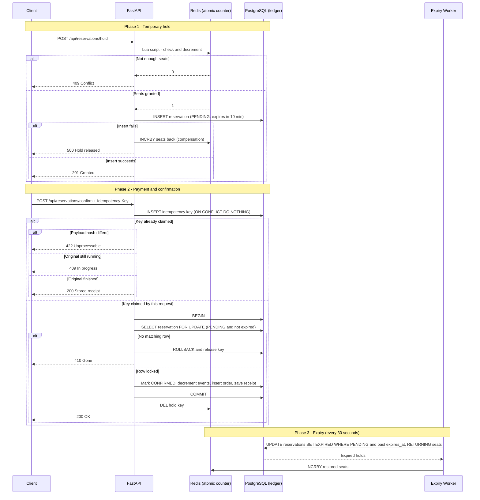

# High-Concurrency Reservation Engine

A backend API for flash-sale ticket reservations that never oversells inventory under concurrent load. It combines an atomic in-memory counter (Redis + Lua) with a durable ledger (PostgreSQL), 10-minute seat holds, and idempotent payment confirmation.

**Verified by automated tests:** 0 oversells with 1,000 concurrent hold requests competing for 20 seats, and exactly one order created when 20 identical payment requests arrive at once.

## Features

- **Atomic inventory counter.** A Redis Lua script checks and decrements available seats in one indivisible step, so concurrent requests can never both claim the last seat. Requests that lose are rejected without touching PostgreSQL.
- **Temporary holds.** A successful hold creates a `PENDING` reservation in PostgreSQL that expires after 10 minutes. Permanent inventory is only decremented when payment is confirmed.
- **Idempotent confirmation.** Each payment request carries an `Idempotency-Key`. The key is claimed with an insert-first pattern, so concurrent duplicates create exactly one order, and retries replay the stored receipt.
- **Expiry-safe confirmation.** Confirming locks the reservation row and re-checks its status and expiry inside the transaction, so an expired hold cannot be paid for even if the cleanup worker hasn't run yet.
- **Hold expiry worker.** A background task polls PostgreSQL every 30 seconds, marks expired holds, and returns their seats to Redis. It polls the database instead of relying on Redis key-expiry notifications, which are fire-and-forget and can be lost.
- **Compensation on failure.** If the database insert fails after Redis granted seats, the seats are returned to Redis.

## Architecture



### Design decisions

| Decision | Reason |
|---|---|
| Redis Lua script instead of `SETNX` locks | Check-and-decrement happens in one atomic step, with no lock expiry or ownership problems to manage. |
| Holds stored in PostgreSQL, not only in Redis | The database is the source of truth, so a Redis restart or lost notification cannot silently drop a reservation. |
| Polling worker instead of Redis keyspace events | Keyspace notifications use Pub/Sub, so any expiry event missed while the worker is down is gone. Polling is self-healing. |
| Permanent inventory touched only on confirm | Avoids row-lock contention on the `events` row for every click; only paid orders reach it. |
| `asyncpg` with raw SQL | Direct control over queries and transactions, with connection pools created at startup (Postgres 10-50, Redis blocking pool of 100). |

**Two counters, two meanings.** The Redis counter means *total minus confirmed minus currently held*. `events.available_seats` in PostgreSQL means *total minus confirmed*.

## Tech Stack

- Python 3.12, FastAPI, Pydantic
- PostgreSQL 16, accessed with `asyncpg`
- Redis 7, accessed with `redis.asyncio`
- Docker and Docker Compose
- pytest, pytest-asyncio, httpx for tests

## Getting Started

```bash
git clone https://github.com/<your-username>/reservation-engine.git
cd reservation-engine
docker compose up --build
```

Compose starts FastAPI, PostgreSQL, and Redis. PostgreSQL runs `init.sql` on first start to create the tables and a sample event. Open http://localhost:8000/docs for the interactive Swagger UI.

To reset to a clean database (init scripts only run on an empty volume):

```bash
docker compose down -v && docker compose up --build
```

## Testing

The test suite runs against the live stack, so start it first with `docker compose up`.

> **Warning:** the tests flush Redis database 0 and truncate the `reservations`, `orders`, and `idempotency_keys` tables before every test. Do not point them at data you care about.

```bash
pip install -r requirements-dev.txt
pytest -v
```

| Test | What it verifies |
|---|---|
| `test_concurrent_single_seat_holds` | 1,000 simultaneous requests (up to 200 in flight) for 20 seats: exactly 20 holds, 980 rejections, no unexpected status codes, and PostgreSQL holds match Redis. |
| `test_concurrent_multi_seat_holds` | 50 requests for 3 seats each against 10 seats: exactly 3 succeed, the counter ends at 1 and never goes negative, and the database agrees. |
| `test_idempotent_concurrent_payments` | 20 simultaneous confirmations with the same key: no server errors, one order, seats decremented once, identical receipts, and a later retry replays the same receipt. |
| `test_idempotency_key_reuse_with_different_payload` | Same key with a different payload is rejected with 422 and creates no second order. |
| `test_confirm_rejected_after_hold_expires` | A hold past `expires_at` cannot be confirmed, even before the worker marks it expired. |

`test_concurrency.sh` is an additional quick smoke test that fires 50 parallel `curl` requests at 10 seats. Process start-up is staggered, so it is less rigorous than the pytest suite, and it checks only HTTP codes and the Redis counter.

## API

### `POST /api/reservations/hold`

Reserves seats for 10 minutes.

```json
{
  "event_id": "a0eebc99-9c0b-4ef8-bb6d-6bb9bd380a11",
  "user_id": "11111111-1111-1111-1111-111111111111",
  "seats": 2
}
```

| Status | Meaning |
|---|---|
| 201 | Hold created; response includes `reservation_id` and `expires_at`. |
| 404 | Event inventory not initialized in Redis. |
| 409 | Not enough seats available. |
| 422 | Invalid request body. |
| 500 | Database error; the held seats were returned to Redis. |

### `POST /api/reservations/confirm`

Finalizes a hold into an order. Payment is **simulated**: `amount_cents` is recorded but no payment gateway is called.

Headers: `Idempotency-Key: <UUID>`

```json
{
  "reservation_id": "<UUID from hold response>",
  "user_id": "11111111-1111-1111-1111-111111111111",
  "amount_cents": 5000
}
```

| Status | Meaning |
|---|---|
| 200 | Order confirmed, or the stored receipt of a previous identical request. |
| 409 | A request with this key is still in progress; retry shortly. |
| 410 | Reservation is expired, already processed, or does not belong to the user. |
| 422 | Idempotency key reused with a different payload, or invalid body. |

## Project Structure

```
app/
  main.py           API routes (hold, confirm) and app lifespan
  database.py       asyncpg and Redis connection pools
  schemas.py        Pydantic request/response models
  lua_scripts.py    Atomic reserve script
  worker.py         Hold-expiry reconciliation loop
  config.py         Settings
tests/
  test_engine.py    Concurrency and idempotency tests
init.sql            Schema and sample event
docker-compose.yml
test_concurrency.sh Quick smoke test
requirements.txt
requirements-dev.txt
pytest.ini
```

## Known Limitations

- **Redis restart.** The counter lives in Redis. After a restart without persistence it must be reseeded; there is no automatic reconciliation from PostgreSQL yet.
- **Worker crash window.** If the worker marks holds `EXPIRED` and crashes before returning the seats to Redis, those seats stay out of the pool until a reconciliation pass corrects the counter.
- **Worker runs inside the API process.** Running several Uvicorn workers starts one expiry loop per worker. A dedicated worker container is the cleaner design.
- **Stuck idempotency claims.** If a process dies mid-confirmation, its in-progress key remains until it is cleaned up after `expires_at`.
- **Single-node Redis** is a single point of failure.
- **No per-user seat cap**, so one user can hold many seats with repeated requests.
- **No authentication.** `user_id` is supplied by the caller.
- **Payment is simulated.**

## Roadmap

- Load test with k6 or Locust to report requests per second, and compare against a plain PostgreSQL `UPDATE ... WHERE remaining > 0` baseline.
- Tests for hold expiry restoring Redis inventory, and for confirmation racing the expiry worker.
- Startup reconciliation that rebuilds the Redis counter from PostgreSQL.
- Separate worker container using `FOR UPDATE SKIP LOCKED` for multi-worker safety.