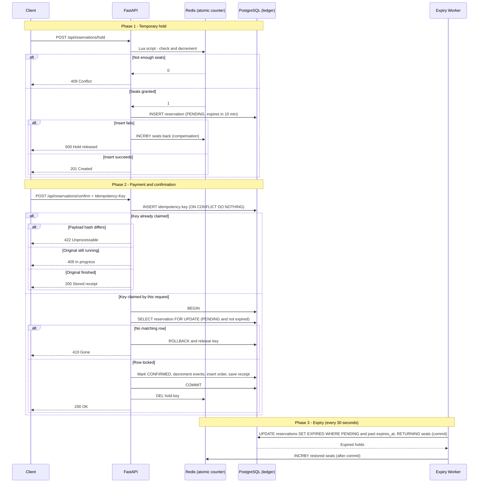

# High-Concurrency Reservation Engine

A backend API for flash-sale ticket reservations that never oversells inventory under concurrent load. It combines an atomic in-memory counter (Redis + Lua) with a durable ledger (PostgreSQL), 10-minute seat holds, and idempotent payment confirmation.

**Results:** 0 oversells across 1,000 concurrent hold requests for 20 seats (a naive implementation oversold by 257-845 seats in the same test), and about 1,900 req/s on the hold endpoint with a p95 of 80 ms, roughly 3.4x an atomic-PostgreSQL baseline on the same machine. See [Benchmarks](#benchmarks) for method and caveats.

## Features

- **Atomic inventory counter.** A Redis Lua script checks and decrements available seats in one indivisible step, so concurrent requests can never both claim the last seat. Requests that lose are rejected without touching PostgreSQL.
- **Temporary holds.** A successful hold creates a `PENDING` reservation in PostgreSQL that expires after 10 minutes. Permanent inventory is only decremented when payment is confirmed.
- **Idempotent confirmation.** Each payment request carries an `Idempotency-Key`. The key is claimed with an insert-first pattern, so concurrent duplicates create exactly one order, and retries replay the stored receipt.
- **Expiry-safe confirmation.** Confirming locks the reservation row and re-checks its status and expiry inside the transaction, so an expired hold cannot be paid for even if the cleanup worker hasn't run yet.
- **Hold expiry worker.** A background task polls PostgreSQL every 30 seconds, marks expired holds, and returns their seats to Redis only after the database change is committed. It polls the database instead of relying on Redis key-expiry notifications, which are fire-and-forget and can be lost.
- **Startup seeding.** On startup, each event's Redis counter is created from PostgreSQL if it is missing (`SET ... NX`, so a live counter is never overwritten).
- **Compensation on failure.** If the database insert fails after Redis granted seats, the seats are returned to Redis.

## Architecture



### Design decisions

| Decision | Reason |
|---|---|
| Redis Lua script instead of `SETNX` locks | Check-and-decrement happens in one atomic step, with no lock expiry or ownership problems to manage. |
| Holds stored in PostgreSQL, not only in Redis | The database is the source of truth, so a Redis restart or lost notification cannot silently drop a reservation. |
| Polling worker instead of Redis keyspace events | Keyspace notifications use Pub/Sub, so any expiry event missed while the worker is down is gone. Polling is self-healing. |
| Redis updated after the database commit in the worker | A crash between the two steps leaks seats (safe) instead of restoring them twice (which could oversell). |
| Permanent inventory touched only on confirm | Avoids row-lock contention on the `events` row for every click; only paid orders reach it. |
| `asyncpg` with raw SQL | Direct control over queries and transactions, with connection pools created at startup (Postgres 10-50, Redis blocking pool of 100). |

**Two counters, two meanings.** The Redis counter means *total minus confirmed minus currently held*. `events.available_seats` in PostgreSQL means *total minus confirmed*.

## Benchmarks

Measured with [k6](https://k6.io) on an Intel Core Ultra 5 225H laptop (16 GB RAM, Windows 11) with k6, Docker Desktop, PostgreSQL 16, Redis 7, and the API all on the same machine. The API ran as a single Uvicorn process with access logs off. Each figure is the **median of 3 runs**. These numbers measure the **hold endpoint only**, not the full purchase flow.

Three implementations were compared on the same endpoint behavior:

- **Naive:** read the count, check it in Python, write it back (the classic race).
- **Atomic PostgreSQL:** a single `UPDATE ... WHERE remaining >= n` in a transaction, no Redis.
- **Redis Lua + PostgreSQL:** this project.

**Correctness: 1,000 requests (200 virtual users) for 20 seats.** Seats sold are counted from database rows, not HTTP status codes.

| Implementation | Seats sold (3 runs) | Oversold |
|---|---:|---:|
| Naive read-then-write | 277 / 847 / 865 | 257 / 827 / 845 |
| Atomic PostgreSQL `UPDATE` | 20 / 20 / 20 | 0 |
| Redis Lua + PostgreSQL | 20 / 20 / 20 | 0 |

**Sustained throughput: 100 virtual users for 15 seconds.**

| Implementation | 1,000,000 seats (every request succeeds) | 20 seats (almost every request rejected) |
|---|---:|---:|
| Naive (incorrect) | 612 req/s, p95 320 ms | 2,584 req/s, p95 65 ms |
| Atomic PostgreSQL `UPDATE` | 572 req/s, p95 331 ms | 2,347 req/s, p95 75 ms |
| Redis Lua + PostgreSQL | **1,926 req/s, p95 80 ms** | **3,262 req/s, p95 56 ms** |

With 1M seats, the Redis version ran at 1,775-1,948 req/s across runs, still about 3x the PostgreSQL baseline (556-577 req/s). In the 20-seat scenario the naive version also oversold by roughly 1,440-1,820 seats.

**Reading the results.** The likely reason for the gap when every request succeeds is that the atomic PostgreSQL version sends every request through one locked row, while the Redis counter takes that contention away so PostgreSQL only handles independent inserts. When most requests are rejected, the Redis version avoids PostgreSQL for them entirely, which gives a smaller advantage (about 39%).

**Caveats.** One machine, one process, and a Docker-on-Windows VM, so absolute numbers will differ elsewhere and the load generator competes with the server for CPU. The confirm step still updates the `events` row and was not benchmarked.

To reproduce:

```bash
docker compose -f docker-compose.yml -f docker-compose.bench.yml up --build -d
python run_bench.py
```

This needs k6 installed and on your PATH. The override enables the `/bench/*` baseline routes (off by default), disables Uvicorn's reload mode, and turns off access logs.

## Tech Stack

- Python 3.12, FastAPI, Pydantic
- PostgreSQL 16, accessed with `asyncpg`
- Redis 7, accessed with `redis.asyncio`
- Docker and Docker Compose
- pytest, pytest-asyncio, httpx for tests; k6 for load testing

## Getting Started

```bash
git clone https://github.com/IFO45/reservation-engine.git
cd reservation-engine
docker compose up --build
```

Compose starts FastAPI, PostgreSQL, and Redis. PostgreSQL runs `init.sql` on first start to create the tables and a sample event, and the API seeds the Redis counter from it. Open http://localhost:8000/docs for the interactive Swagger UI. In Swagger, use the sample event ID `a0eebc99-9c0b-4ef8-bb6d-6bb9bd380a11`; the pre-filled placeholder ID does not exist.

To reset to a clean database (init scripts only run on an empty volume):

```bash
docker compose down -v && docker compose up --build
```

## Testing

The test suite runs against the live stack. The worker tests need the expiry worker to run every 2 seconds instead of 30, so start the stack with the test override:

```bash
docker compose -f docker-compose.yml -f docker-compose.test.yml up --build -d
pip install -r requirements-dev.txt
pytest -v
```

> **Warning:** the tests flush Redis database 0 and truncate the `reservations`, `orders`, and `idempotency_keys` tables before every test. Do not point them at data you care about.

| Test | What it verifies |
|---|---|
| `test_concurrent_single_seat_holds` | 1,000 simultaneous requests (up to 200 in flight) for 20 seats: exactly 20 holds, 980 rejections, no unexpected status codes, and PostgreSQL holds match Redis. |
| `test_concurrent_multi_seat_holds` | 50 requests for 3 seats each against 10 seats: exactly 3 succeed, the counter ends at 1 and never goes negative, and the database agrees. |
| `test_idempotent_concurrent_payments` | 20 simultaneous confirmations with the same key: no server errors, one order, seats decremented once, identical receipts, and a later retry replays the same receipt. |
| `test_idempotency_key_reuse_with_different_payload` | Same key with a different payload is rejected with 422 and creates no second order. |
| `test_confirm_rejected_after_hold_expires` | A hold past `expires_at` cannot be confirmed, even before the worker marks it expired. |
| `test_worker_restores_expired_seats_exactly_once` | An expired hold returns its seats to Redis once, becomes `EXPIRED`, and is not restored again on later worker passes. |
| `test_worker_ignores_confirmed_reservations` | A paid reservation stays `CONFIRMED` and keeps its seats even with a past `expires_at`. |
| `test_confirm_racing_worker_never_double_counts` | 20 holds expire at staggered times while confirmations arrive around each expiry and the worker sweeps; every seat ends up either sold (confirmed plus an order) or returned (expired and restored), and Redis, `events`, and order counts agree. |

The race test does not force one specific interleaving, so run it repeatedly: `for i in {1..10}; do pytest -q || break; done`.

`test_concurrency.sh` is an additional quick smoke test that fires 50 parallel `curl` requests at 10 seats. Process start-up is staggered, so it is less rigorous than the pytest suite, and it checks only HTTP codes and the Redis counter.

## API

### `POST /api/reservations/hold`

Reserves seats for 10 minutes. Expired holds are returned to the pool within about 30 seconds of expiry.

```json
{
  "event_id": "a0eebc99-9c0b-4ef8-bb6d-6bb9bd380a11",
  "user_id": "11111111-1111-1111-1111-111111111111",
  "seats": 2
}
```

| Status | Meaning |
|---|---|
| 201 | Hold created; response includes `reservation_id` and `expires_at`. |
| 404 | Event inventory not initialized in Redis. |
| 409 | Not enough seats available. |
| 422 | Invalid request body (for example, `seats` must be greater than 0). |
| 500 | Database error; the held seats were returned to Redis. |

### `POST /api/reservations/confirm`

Finalizes a hold into an order. Payment is **simulated**: `amount_cents` is recorded but no payment gateway is called.

Headers: `Idempotency-Key: <UUID>`

```json
{
  "reservation_id": "<UUID from hold response>",
  "user_id": "11111111-1111-1111-1111-111111111111",
  "amount_cents": 5000
}
```

| Status | Meaning |
|---|---|
| 200 | Order confirmed, or the stored receipt of a previous identical request. |
| 409 | A request with this key is still in progress (retry shortly), or inventory is exhausted. |
| 410 | Reservation is expired, already processed, or does not belong to the user. |
| 422 | Idempotency key reused with a different payload, or invalid body. |

## Project Structure

```
app/
  main.py           API routes (hold, confirm) and app lifespan
  database.py       asyncpg and Redis pools, startup seeding
  schemas.py        Pydantic request/response models
  lua_scripts.py    Atomic reserve script
  worker.py         Hold-expiry reconciliation loop
  config.py         Settings (environment variables)
  bench_routes.py   Benchmark-only baselines (enabled with ENABLE_BENCH_ROUTES=1)
tests/
  test_engine.py    Concurrency and idempotency tests
  test_worker.py    Expiry worker tests
init.sql            Schema and sample event
docker-compose.yml
docker-compose.test.yml    Worker interval 2s for tests
docker-compose.bench.yml   Benchmark mode (baseline routes, no reload)
bench.js            k6 load script
run_bench.py        Runs all benchmark variants and prints the table
test_concurrency.sh Quick smoke test
requirements.txt
requirements-dev.txt
pytest.ini
```

## Known Limitations

- **Redis counter drift.** The counter is seeded from PostgreSQL at startup only if the key is missing. If Redis loses data while the API is running, hold requests return 404 until the API restarts and reseeds.
- **Seats can leak, but not oversell.** Expired holds are committed in PostgreSQL before seats are returned to Redis. If the process dies between the two steps, those seats stay out of the pool until the next reseed. There is no periodic reconciliation yet.
- **Worker runs inside the API process.** Running several Uvicorn workers starts one expiry loop per worker. They do not corrupt each other, but a dedicated worker container is the cleaner design.
- **Stuck idempotency claims.** If a process dies mid-confirmation, its in-progress key remains until it is cleaned up after `expires_at`.
- **Benchmarks cover the hold path only.** The confirm step still updates the `events` row and was not load tested.
- **Single-node Redis** is a single point of failure.
- **No per-user seat cap**, so one user can hold many seats with repeated requests.
- **No authentication.** `user_id` is supplied by the caller.
- **Payment is simulated.**

## Roadmap

- GitHub Actions workflow that starts the stack and runs the test suite on every push.
- Periodic job that rebuilds the Redis counter from PostgreSQL, so drift is corrected without a restart.
- Dedicated worker container using `FOR UPDATE SKIP LOCKED` so multiple workers do not block each other.
- Load test the confirm path and multi-process deployments.
